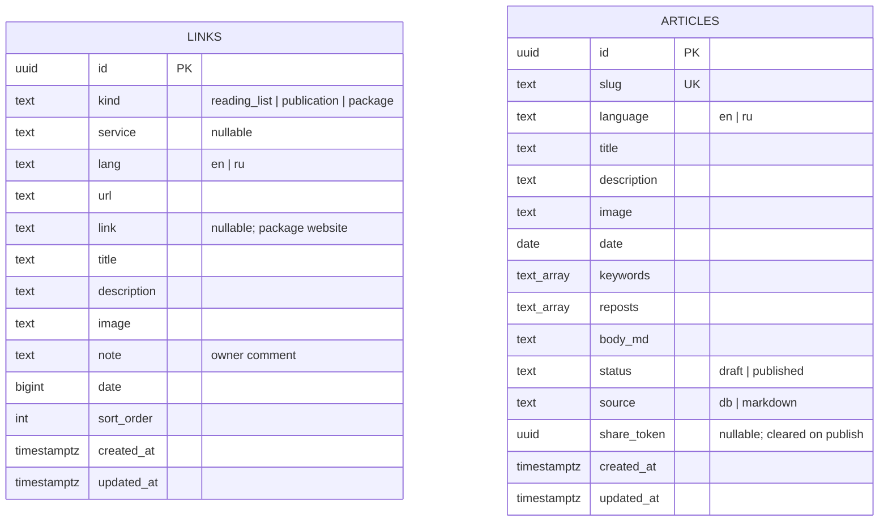
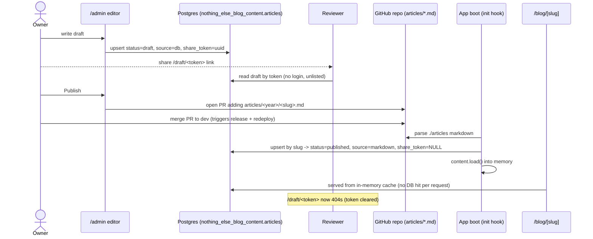

# 0001 — Runtime Postgres-backed content model

- **Status:** Implemented (pending review on `feat/content-runtime-postgres`)
- **Date:** 2026-06-27
- **Author:** Sergey Nikitin

## Motivation

Today the site's content metadata (`meta/index.json`) is generated by `src/ci/links.ts` **at Docker build time** (`RUN pnpm meta` in the `Dockerfile`). That script scrapes external links (Medium/Habr/Dev.to via `metascraper`), npm/GitHub packages, parses `./articles` markdown, and bakes a single JSON file into the image. At runtime the file is read once and cached forever (`src/lib/server/selectors.ts`).

Two problems:

1. **Build-time scraping is unreliable and couples content to releases.** A slow/flaky/changed external page degrades the metadata or fails the build, so a deploy can break for reasons unrelated to the code — and content cannot change without a redeploy.
2. **No way to add content without redeploying.** The owner wants to add reading-list items / external publications / packages at runtime, and to write blog articles in an on-site editor with drafts and private review links, publishing to the repo when ready.

### Intended outcome

- All _dynamic_ content lives in the **Postgres** (new `nothing_else_blog_content` schema, reused connection), loaded once into memory at boot and served from there; refreshed on demand via an admin **Revalidate** button.
- The Docker build does **zero** external scraping — deploys stop depending on third-party sites.
- **Published articles stay canonical as `./articles/<year>/<slug>.md` in git.** The DB is a serving cache + draft workspace; at every launch the app reconciles the DB _from_ the markdown (git wins). Git doubles as a durable backup if the free-tier DB is ever wiped.

## Diagram

### ER — `nothing_else_blog_content` schema

`LINKS` and `ARTICLES` are independent (no FK); both are served from the same in-memory cache. Articles authored on-site start as `status=draft, source=db` with a `share_token`; once published to git they become `status=published, source=markdown, share_token=NULL` via launch reconciliation.

### Article lifecycle

## Plan

Implemented in phases; see the saved plan for the canonical step list. Summary:

- **Phase 0 — Docs scaffolding (this doc).** `AGENTS.md`, `docs/README.md`, `docs/_template.md`, and this RFC.
- **Phase 1 — Data layer.** `src/lib/server/db.ts` (single `pg.Pool`, `max: 2`, `idleTimeoutMillis: 10_000`, `ssl: { rejectUnauthorized: false }`, `DATABASE_URL` from `getRuntimeEnvironment()`); `src/lib/server/db/schema.sql` (idempotent `nothing_else_blog_content.links` + `nothing_else_blog_content.articles`); `src/lib/server/content.ts` (in-memory store: `load()`, sync getters, `revalidate()`).
- **Phase 2 — Serve from cache.** Rewire `src/lib/server/selectors.ts` to read from `content.ts`; move `env` (version/commit/accounts) to `process.env`; warm the cache in `src/hooks.server.ts` `init`; extend `/api/v1/health` with `counts: { articles, packages, links }` and return `503` when empty.
- **Phase 3 — Remove build scrape.** Delete `RUN pnpm meta`; retire `meta/index.json` and the `src/ci/*` scrape pipeline (relocate `parseMarkdown`/`getReadingTime`/`readMarkdownFile` to `src/lib/server`); add a Node-based `Dockerfile HEALTHCHECK`; `scripts/seed.ts` to import existing data on cutover.
- **Phase 4 — Auth + admin shell.** `@auth/sveltekit` GitHub provider, allowlist `GH_AUTHOR_LOGIN`; protect `/admin/*`; shell lists links/articles with edit/delete + Revalidate.
- **Phase 5 — Links management.** `/admin/links` manual-entry form + CRUD (auto-fill from `getLinkInfo()` is a future enhancement).
- **Phase 6 — Article editor.** Draft editor + preview, `/draft/[token]` unlisted review, publish opens a GitHub PR.
- **Phase 7 — Launch reconciliation.** `src/lib/server/articles-sync.ts` upserts `./articles` by slug as `published/markdown`, clearing share tokens.

### Reusable building blocks

`getLinkInfo()` (`src/lib/server/meta.ts`), `parseMarkdown`/`getReadingTime`/`readMarkdownFile` (`src/ci/internal.ts` → relocate), `uploadFile()` + `POST /api/v1/upload-image` (`src/lib/server/cloudinary.ts`), `getRuntimeEnvironment()` (`src/lib/server/env.ts`), and the existing GitHub OAuth app.

### Markdown contract (PR export must match)

Path `articles/<YYYY>/<slug>.md` (year from `date`). Frontmatter order: `title`, `image` (optional), `description`, `language`, `date` (`YYYY-MM-DD`), `keywords` (list), `reposts` (list, optional), `draft` (`false`). Slug = filename without extension.

## Decisions & alternatives

- **Reuse existing Aiven Postgres, new `nothing_else_blog_content` schema** — free tier allows one service per type and caps at 20 connections with no pooler; a second free PG isn't possible and isn't needed. Rejected: a separate DB/service, NoSQL/KV (data is small and relational; KV repeats the JSON-blob hack we're removing).
- **Raw `pg`, tiny pool** — matches the owner's other service; the in-memory cache means ~1 connection in use. Rejected: an ORM (unnecessary for a tiny schema, adds inconsistency with the other service).
- **In-memory cache, single replica** — site runs 1 replica, so a module-level cache + admin Revalidate button is correct and simple. A multi-replica TTL/version-poll fallback is explicitly out of scope until the site scales.
- **Git canonical for published articles** — durable, versioned, free backup; DB rehydrates from markdown at boot. Rejected: DB as sole source (loses git history and durability on a free tier that can be wiped/powered off).
- **Owner-only auth via the existing GitHub OAuth flow + a signed session cookie** — the repo's `/api/v1/oauth` already verifies the user is `GH_AUTHOR_LOGIN`; we extend it with an `ADMIN_LOGIN` action that issues an HMAC-signed `admin_session` cookie (`src/lib/server/session.ts`), guarded in `hooks.server.ts`. Chosen over `@auth/sveltekit` because a GitHub OAuth App allows only one callback URL (already used by the reading-list flow), so Auth.js would have required a second OAuth App + new secrets. No new dependency, reuses the proven owner check.

## Verification

1. **Docs:** `AGENTS.md` + the three `docs/*` files exist; Mermaid diagrams render in preview/GitHub.
2. **Local boot:** point `DATABASE_URL` at a scratch Postgres; confirm `schema.sql` creates `content.*`, reconciliation imports the existing markdown articles, and `/blog` renders from the DB cache (not `meta/index.json`).
3. **Links:** add a reading-list item in `/admin/links` → appears on `/reading-list` after revalidate, no redeploy.
4. **Article lifecycle:** draft → `/draft/<token>` visible logged-out → publish opens a PR with markdown matching `articles/2023/axios-...md` style → merge/redeploy → `/blog/<slug>` serves it and `/draft/<token>` 404s.
5. **Reliability:** Docker build succeeds with all external sites unreachable (no `pnpm meta`).
6. **Connections:** `pg_stat_activity` shows ≤2 connections from this service.
7. **Health:** `/api/v1/health` returns non-zero `counts` and `200`; empty cache returns `503`; `docker inspect` reaches `healthy` only after boot/reconciliation.

## Follow-ups

- ~~The public `/reading-list` page still reads the Cloudinary file.~~ Done: the page reads `kind = 'reading_list'` links from the content cache; `saveReadingList()` now scrapes via `getLinkInfo()` and writes to `nothing_else_blog_content.links` (Cloudinary is no longer the reading-list store; it still serves image uploads).
- Required env (runtime): `DATABASE_HOST`, `DATABASE_USER`, `DATABASE_PASSWORD`, `DATABASE_NAME`, `DATABASE_PORT`; version via `APP_VERSION` / `COMMIT_HASH`. Optional (publishing): `GITHUB_REPO_TOKEN`, `GITHUB_REPO_OWNER`, `GITHUB_REPO_NAME`. Admin login reuses `GITHUB_CLIENT_ID` / `GITHUB_SECRET`; the session cookie is signed with `GITHUB_SECRET`.
