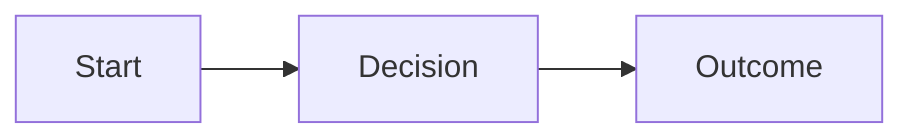

# NNNN — <Title>

- **Status:** Proposed | Accepted | Implemented | Superseded
- **Date:** YYYY-MM-DD
- **Author:** <name>

## Motivation

What problem does this solve? Why now? What is the intended outcome? What breaks or stays painful if we do nothing?

## Diagram

At least one Mermaid diagram (architecture, ER, sequence, or flow):

## Plan

The detailed, phased implementation plan. Name the files to create/modify and the reusable building blocks. Describe patterns once rather than enumerating every line.

## Decisions & alternatives

Key choices made and the alternatives rejected, with a one-line reason each.

## Verification

How the change is proven to work end-to-end (run the app, hit endpoints, run tests). Be concrete.
